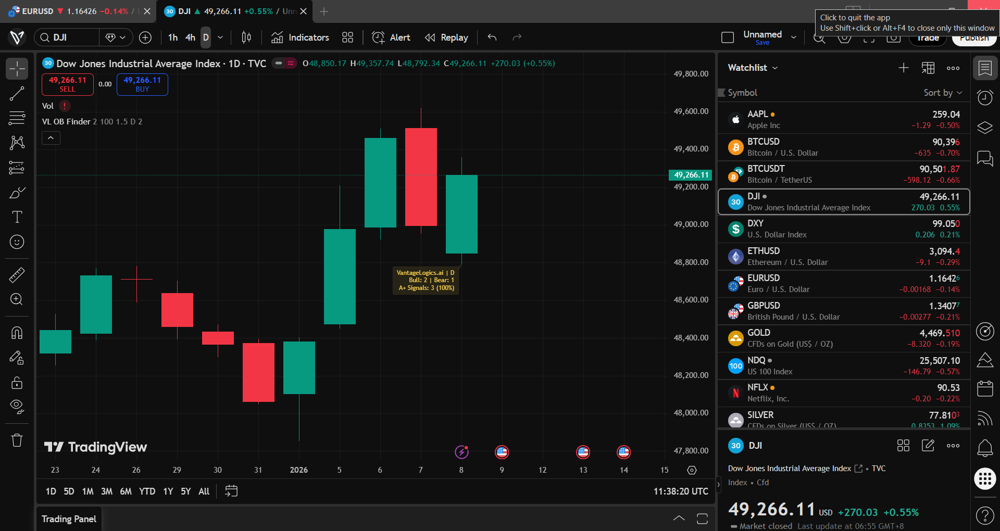
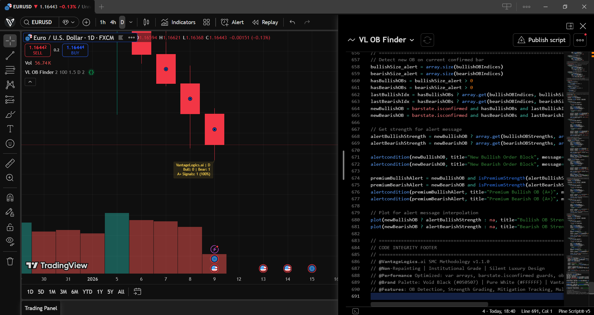
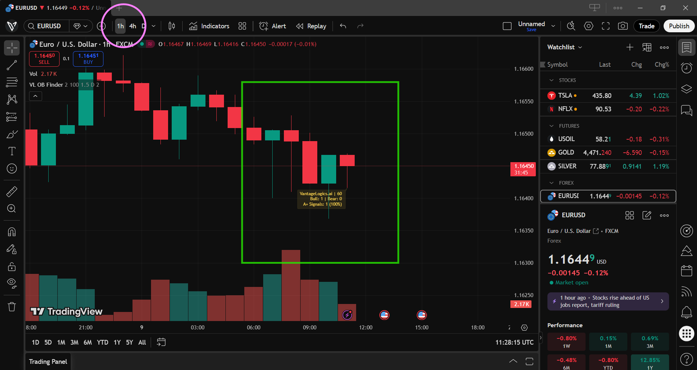
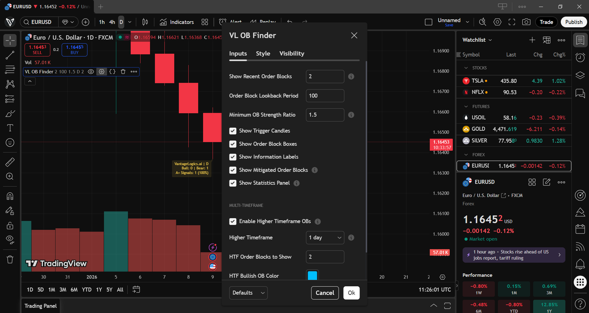

# VantageLogics Order Block Finder [SMC]

[](https://www.tradingview.com/)
[](https://www.tradingview.com/pine-script-docs/)
[](LICENSE)
[](CHANGELOG.md)

**Institutional-Grade Trading System.**

---

## Overview

The **VantageLogics Order Block Finder** is a professional Pine Script v5 indicator that identifies institutional Order Blocks using Smart Money Concepts (SMC) methodology. Designed for serious traders who want clean, accurate, and non-repainting signals.

### Key Features

- **Non-Repainting Logic** - All signals are confirmed on bar close
- **Strength Grading** - A+, A, B, C grades for signal quality
- **Multi-Timeframe (MTF)** - View higher TF Order Blocks on lower TF charts
- **Mitigation Tracking** - Know when OBs have been tested
- **Clean Visualization** - Professional "Silent Luxury" design
- **Performance Optimized** - Efficient array management and caching

---

## Screenshots

| Bullish Order Block | Bearish Order Block | MTF Analysis |
|---------------------|---------------------|--------------|
|  |  |  |

### Indicator Settings


---

## Installation

### Option 1: TradingView (Recommended)
1. Open [TradingView](https://www.tradingview.com/)
2. Search for "VantageLogics Order Block Finder" in the Indicators
3. Add to your chart

### Option 2: Manual Installation
1. Copy the contents of `VantageLogics_OrderBlockFinder.pine`
2. Open TradingView > Pine Editor
3. Paste the code and click "Add to Chart"

---

## How It Works

### Order Block Detection

**Bullish Order Block (Buy Zone)**
- Detects the last bearish candle before a strong upward breakout
- Price breaking above with momentum signals institutional buying
- When price returns to this zone = potential BUY opportunity

**Bearish Order Block (Sell Zone)**
- Detects the last bullish candle before a strong downward breakout
- Price breaking below with momentum signals institutional selling
- When price returns to this zone = potential SELL opportunity

### Strength Grading System

| Grade | Color | Meaning |
|-------|-------|---------|
| **A+** | Gold | Strongest signal - highest institutional conviction |
| **A** | White | Strong signal - good trade setup |
| **B** | White | Moderate signal - use with confluence |
| **C** | White | Weak signal - requires confirmation |

### Visual Guide

| Element | Meaning |
|---------|---------|
| **Gold box** | A+ premium signal |
| **White box** | Standard signal (A, B, or C) |
| **Dashed box** | Mitigated (price already tested) |
| **Blue box** | MTF Bullish OB (higher timeframe) |
| **Red box** | MTF Bearish OB (higher timeframe) |
| **[M] label** | Mitigated status |

---

## Settings

### Display Settings

| Setting | Default | Description |
|---------|---------|-------------|
| Show Recent Order Blocks | 2 | Number of OBs to display (1-10) |
| Order Block Lookback | 100 | Historical bars to analyze |
| Minimum OB Strength | 1.5 | Filter threshold for signals |
| Show Trigger Candles | ON | Display OB trigger markers |
| Show Order Block Boxes | ON | Visualize OB zones |
| Show Information Labels | ON | Display strength grades |
| Show Mitigated OBs | ON | Show tested zones |
| Show Statistics Panel | ON | Display stats overlay |

### Multi-Timeframe Settings

| Setting | Default | Description |
|---------|---------|-------------|
| Enable Higher Timeframe OBs | OFF | Toggle MTF display |
| Higher Timeframe | D | Select: 4H, D, W, M |
| HTF Order Blocks to Show | 2 | Number of HTF OBs |
| HTF Bullish OB Color | Blue | Customize bullish zone |
| HTF Bearish OB Color | Red | Customize bearish zone |

---

## FAQ

**Q: Why do different timeframes show different signals?**

This is normal. Each timeframe shows its own market structure. Daily shows institutional positioning, while 1H/4H shows shorter-term movements. Use MTF to see both perspectives.

**Q: Should I only trade A+ signals?**

A+ signals have the highest conviction, but A and B grades can work with additional confluence (trend direction, support/resistance). Avoid C grades without strong confirmation.

**Q: Why did an Order Block disappear?**

OBs are removed when they exceed the lookback period or the "Show Recent Order Blocks" limit. Adjust settings to see more history.

**Q: MTF shows different direction than current timeframe?**

This is valuable information:
- **Aligned** = High confluence, stronger signal
- **Conflicting** = Caution, possible reversal or pullback

---

## Trading Strategy

### Basic Workflow

1. **Identify the Order Block** - Look for Gold (A+) or White boxes
2. **Wait for Price Return** - OBs work when price comes back to the zone
3. **Confirm Entry** - Look for candlestick patterns (engulfing, pin bar)
4. **Set Stop Loss** - Below OB for longs, above OB for shorts
5. **Target** - Previous swing high/low or 1:2 risk-reward

### MTF Workflow

1. Enable MTF and select Daily timeframe
2. View chart on 4H or 1H
3. Identify Daily OB zones (blue/red)
4. Wait for lower TF confirmation within the zone
5. Enter with tighter stop loss for better R:R

---

## Technical Specifications

- **Pine Script Version:** v5
- **Non-Repainting:** Yes (`barstate.isconfirmed` guards)
- **Resource Limits:** 500 lines, 200 labels, 100 boxes
- **Memory Optimized:** `var` keyword for persistent arrays

### Detection Logic

```
Bullish OB:
1. Previous candle is bearish (close < open)
2. Current candle breaks above previous high
3. Current candle closes in upper 60% of range
4. Size validated against ATR

Bearish OB:
1. Previous candle is bullish (close > open)
2. Current candle breaks below previous low
3. Current candle closes in lower 40% of range
4. Size validated against ATR
```

---

## File Structure

```
VantageLogics-OrderBlock-Finder/
├── README.md                           # This file
├── LICENSE                             # MIT License
├── CHANGELOG.md                        # Version history
├── VantageLogics_OrderBlockFinder.pine # Main indicator
├── docs/
│   └── TRADING_GUIDE.md               # Detailed trading guide
└── screenshots/
    ├── bullish_ob_example.png
    ├── bearish_ob_example.png
    └── mtf_example.png
```

---

## Contributing

Contributions are welcome! Please:

1. Fork the repository
2. Create a feature branch (`git checkout -b feature/amazing-feature`)
3. Commit changes (`git commit -m 'Add amazing feature'`)
4. Push to branch (`git push origin feature/amazing-feature`)
5. Open a Pull Request

---

## Risk Disclaimer

This indicator is a **tool for analysis**, not a trading signal generator.

- Past performance does not guarantee future results
- Always use proper risk management
- Never risk more than you can afford to lose
- This is not financial advice - do your own research

---

## License

This project is licensed under the MIT License - see the [LICENSE](LICENSE) file for details.

---

## About VantageLogics.ai

Professional Smart Money Concepts methodology for serious traders.

*Silent Luxury. Invisible Corporate. Data-Over-Hype.*

---

## Support

- **Issues:** [GitHub Issues](../../issues)
- **Discussions:** [GitHub Discussions](../../discussions)
- **TradingView:** Comment on the published script

---

**Free indicator - Use at your own discretion**
